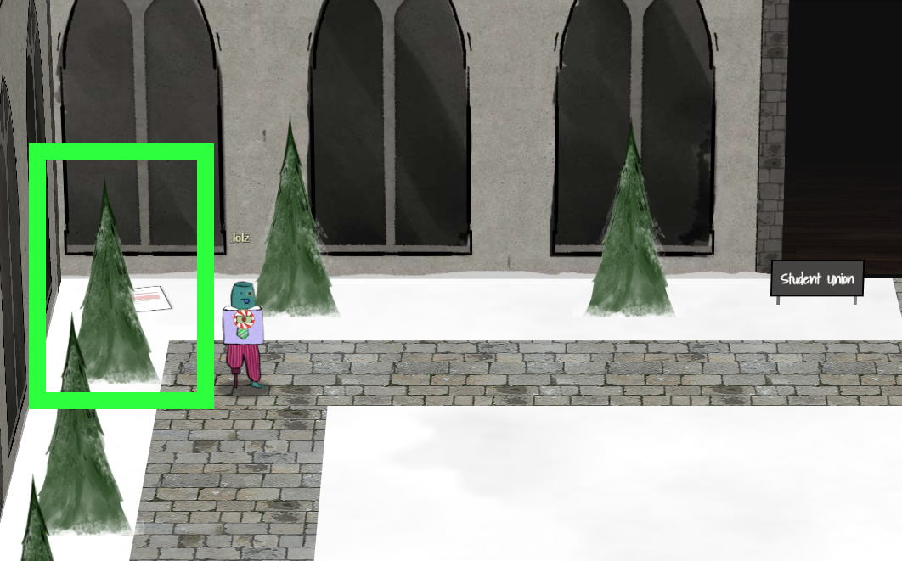

# Unredact Threatening Document
## Prompt
Someone sent a threatening letter to Elf University. What is the first word in ALL CAPS in the subject line of the letter? Please find the letter in the Quad.

# Solve Process

1. Walking around the quad, we find a clickable item hidden in the top-left, which looks like a letter. 
1. Opening the letter, we find a PDF with an image "redaction".
1. Highlighting the text and copying it reveals the subject. If we couldn't highlight the text, we could've extracted it with command line tools for PDFs.
1. "Subject: DEMAND: Spread Holiday Cheer to Other Holidays"
1. Result = DEMAND

# rest of letter un-redacted (CTRL+A, CTRL+C)

Date: February 28, 2019

To the Administration, Faculty, and Staff of Elf University
17 Christmas Tree Lane
North Pole

From: A Concerned and Aggrieved Character

Subject: DEMAND: Spread Holiday Cheer to Other Holidays and Mythical Characters… OR
ELSE!

Attention All Elf University Personnel,

It remains a constant source of frustration that Elf University and the entire operation at the
North Pole focuses exclusively on Mr. S. Claus and his year-end holiday spree. We URGE
you to consider lending your considerable resources and expertise in providing merriment,
cheer, toys, candy, and much more to other holidays year-round, as well as to other mythical
characters.

For centuries, we have expressed our frustration at your lack of willingness to spread your
cheer beyond the inaptly-called “Holiday Season.” There are many other perfectly fine
holidays and mythical characters that need your direct support year-round.

If you do not accede to our demands, we will be forced to take matters into our own hands.
We do not make this threat lightly. You have less than six months to act demonstrably.

Sincerely,

--A Concerned and Aggrieved Character